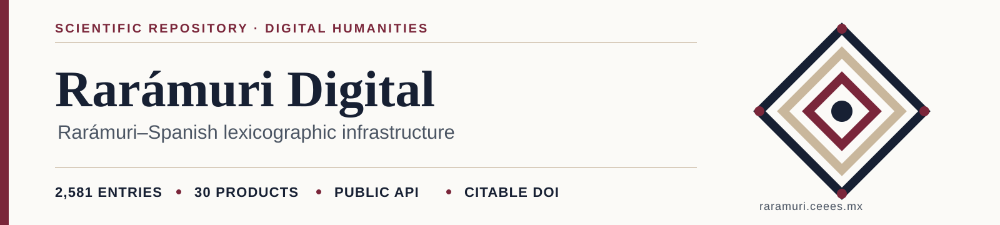

<p align="center">
  
</p>

<p align="center">
  <strong>A Rarámuri–Spanish lexicographic infrastructure for academic consultation, linguistic analysis, digital humanities, and application development.</strong>
</p>

<p align="center">
  <a href="https://doi.org/10.5281/zenodo.21483353"></a>
  <a href="RELEASE_NOTES_1.0.0.md"></a>
  <a href="CHANGELOG.md"></a>
  <a href="public/downloads/manifest.json"></a>
  <a href="public/downloads/manifest.json"></a>
  <a href="https://orcid.org/0000-0002-3168-6725"></a>
  <a href="https://zenodo.org/records/21483353"></a>
</p>

<p align="center">
  <a href="https://github.com/fersandovalgtz/raramuri-digital/actions/workflows/validate.yml"></a>
  <a href="public/downloads/raramuri-lex0.xml"></a>
  <a href="https://raramuri.ceees.mx/api/openapi"></a>
  <a href="codemeta.json"></a>
  <a href="CITATION.cff"></a>
  <a href="project-metadata.json"></a>
  <a href="public/downloads/manifest.json"></a>
</p>

<p align="center">
  <a href="LICENSE.md"></a>
  <a href="DATA_LICENSE.md"></a>
  <a href="CONTRIBUTORS.md"></a>
  <a href="#editorial-status"></a>
</p>

<p align="center">
  <a href="https://raramuri.ceees.mx"><strong>Public website</strong></a> ·
  <a href="#try-it-in-30-seconds">Try it</a> ·
  <a href="https://raramuri.ceees.mx/descargas">Data and API</a> ·
  <a href="#scientific-documentation">Scientific documentation</a> ·
  <a href="#interoperable-formats">Formats</a> ·
  <a href="#lexicographic-api">API</a> ·
  <a href="#linguistic-rights-and-governance">Governance</a> ·
  <a href="#citation">Cite</a> ·
  <a href="README.md">Español</a>
</p>

| Dataset | Platform | Entries | Products | Linguistic status |
|---|---|---:|---:|---|
| 1.0.0 | 3.1.0 | 2,581 | 30 | Validation pending |

## Try it in 30 seconds

Query five results related to `agua` through the public API:

```bash
curl "https://raramuri.ceees.mx/api/lexicon?q=agua&limit=5"
```

Download the dataset directly in the format you need:

[CSV](public/downloads/raramuri-lexico.csv) ·
[JSON](public/downloads/raramuri-lexico.json) ·
[XML](public/downloads/raramuri-lexico.xml) ·
[SQL](public/downloads/raramuri-lexico.sql) ·
[TEI Lex-0](public/downloads/raramuri-lex0.xml) ·
[OpenAPI](public/downloads/openapi-lexico.json)

> [!NOTE]
> Publication is authorized for dissemination, but linguistic validation remains pending. Reuse must preserve attribution and provenance and follow [`GOVERNANCE.md`](GOVERNANCE.md).

If this resource supports your research, teaching, or development work, cite the DOI and star ⭐ the repository to improve its discoverability.

---

<p align="center">
  <a href="https://ceees.mx/" title="Universidad CEEES">
    
  </a>
  &nbsp;&nbsp;&nbsp;&nbsp;
  <a href="https://www.uacj.mx/" title="Universidad Autónoma de Ciudad Juárez">
    
  </a>
  &nbsp;&nbsp;&nbsp;&nbsp;
  <a href="https://erevistas.uacj.mx/ojs/index.php/biniriame/about" title="Academic Group UACJ-113">
    
  </a>
</p>

## Project lead

**Dr. Fernando Sandoval Gutierrez**<br>
Academic and technical coordination<br>
Universidad CEEES · Universidad Autónoma de Ciudad Juárez · Academic Group UACJ-113<br>
[fernando.sandoval@uacj.mx](mailto:fernando.sandoval@uacj.mx) · [ORCID 0000-0002-3168-6725](https://orcid.org/0000-0002-3168-6725)

## 🏛️ Institutions

- [Universidad CEEES](https://ceees.mx/), Centro de Estudios Especializados en Educación Superior.
- [Universidad Autónoma de Ciudad Juárez](https://www.uacj.mx/), Multidisciplinary Division at Cuauhtémoc.
- [Academic Group UACJ-113](https://erevistas.uacj.mx/ojs/index.php/biniriame/about), Studies on Educational Practices and Interculturality.

## Coverage

- 2,581 lexical entries with persistent identifiers.
- Lemma, source form, normalized form, and homonym number.
- Grammatical classification and category family.
- Translation, senses, examples, variants, and source comments.
- Source code, document, pages, and transcription status.
- 30 derived products: corpora, inventories, variants, indexes, thesaurus, ontology, and traceability.

## Scientific documentation

- [Dataset datasheet](DATASHEET.en.md) · [Español](DATASHEET.md)
- [Data schema and dictionary](SCHEMA.md)
- [Reproducible quality report](QUALITY_REPORT.md) · [JSON](public/downloads/quality-report.json)
- [Governance and linguistic rights](GOVERNANCE.md)
- [Corrections and contributions](CONTRIBUTING.md)
- [Support](SUPPORT.md) · [Security](SECURITY.md) · [Code of conduct](CODE_OF_CONDUCT.md)
- [Authorship and CRediT roles](CONTRIBUTORS.md)
- [Changelog](CHANGELOG.md) · [Release checklist](RELEASE_CHECKLIST.md) · [1.0.0 notes](RELEASE_NOTES_1.0.0.md)
- [CodeMeta metadata](codemeta.json) · [CFF citation](CITATION.cff)

## Interoperable formats

| Product | File | Intended use |
|---|---|---|
| Lexicographic XML | [`raramuri-lexico.xml`](public/downloads/raramuri-lexico.xml) | Digital humanities and XML transformations |
| JSON | [`raramuri-lexico.json`](public/downloads/raramuri-lexico.json) | Web and mobile applications |
| CSV | [`raramuri-lexico.csv`](public/downloads/raramuri-lexico.csv) | Research and statistical analysis |
| SQL | [`raramuri-lexico.sql`](public/downloads/raramuri-lexico.sql) | Normalized SQLite 3 database |
| TEI Lex-0 | [`raramuri-lex0.xml`](public/downloads/raramuri-lex0.xml) | Interoperable electronic dictionaries |
| OpenAPI | [`openapi-lexico.json`](public/downloads/openapi-lexico.json) | Client and service integration |

The [technical manifest](public/downloads/manifest.json) records each export’s size, media type, coverage, and SHA-256 checksum.

## Lexicographic API

Production endpoint:

```text
GET https://raramuri.ceees.mx/api/lexicon
```

Examples:

```text
GET /api/lexicon?id=RD-000001
GET /api/lexicon?q=agua&limit=25
GET /api/lexicon?pos=Vt&page=2
GET /api/lexicon?format=csv
```

Specification: [OpenAPI 3.1](https://raramuri.ceees.mx/api/openapi).

## Repository structure

```text
app/                 Website, pages, components, and API
data/                Master datasets and derived products
db/                  Relational schema
drizzle/             Migration and master database seed
lib/                 Product models and derivations
public/downloads/    XML, JSON, CSV, SQL, TEI Lex-0, and OpenAPI
scripts/             Reproducible extraction and generation
tests/               Coverage and integrity tests
*.md                  Datasheet, schema, quality, governance, and release documents
```

## Development

Node.js 22.13 or later is required.

```bash
npm install
npm run data:exports
npm run data:quality
npm run validate
npm run dev
```

## Editorial status

- **Publication:** authorized for public dissemination.
- **Transcription:** structured with page-level traceability.
- **Linguistic validation:** pending.

Authorization for dissemination does not constitute linguistic validation. Corrections must preserve the entry identifier and documentary provenance.

## 🧭 Linguistic rights and governance

Indigenous Peoples have the right to preserve, revitalize, use, develop, and transmit their languages to future generations. This right is recognized by [Article 13 of the United Nations Declaration on the Rights of Indigenous Peoples](https://digitallibrary.un.org/record/606782?ln=en) and, in Mexico, by the [General Law on the Linguistic Rights of Indigenous Peoples](https://www.diputados.gob.mx/LeyesBiblio/pdf/LGDLPI.pdf).

This infrastructure is intended to support Rarámuri documentation, consultation, and teaching. It does not replace the linguistic, cultural, or political authority of communities and speakers. Data reuse must retain attribution and provenance, prevent appropriation and decontextualization, respect community decisions and restrictions, and support effective Rarámuri participation in corpus validation, correction, and governance.

## Licenses

This repository uses separate licenses according to the nature of each component:

- **Source code and software components:** [MIT License](LICENSE.md).
- **Project-produced data, lexicographic exports, derived products, and documentation:** [Creative Commons Attribution–NonCommercial–ShareAlike 4.0 International](DATA_LICENSE.md).
- **Facsimiles, source texts, logos, and third-party materials:** retain their original rights and terms; their presence in the repository does not place them under either license above.

The MIT License does not grant permissions over data, cultural materials, or third-party content. Data reuse must preserve attribution and provenance, follow the governance described in [`GOVERNANCE.md`](GOVERNANCE.md), and avoid appropriation or decontextualization.

## Citation

Sandoval Gutierrez, F. (2026). *Rarámuri Digital: conjunto de datos lexicográficos rarámuri–español* (Version 1.0.0) [Data set]. Zenodo. <https://doi.org/10.5281/zenodo.21483353>

Use [`CITATION.cff`](CITATION.cff) to generate additional citation styles. The operating platform version is 3.1.0.
