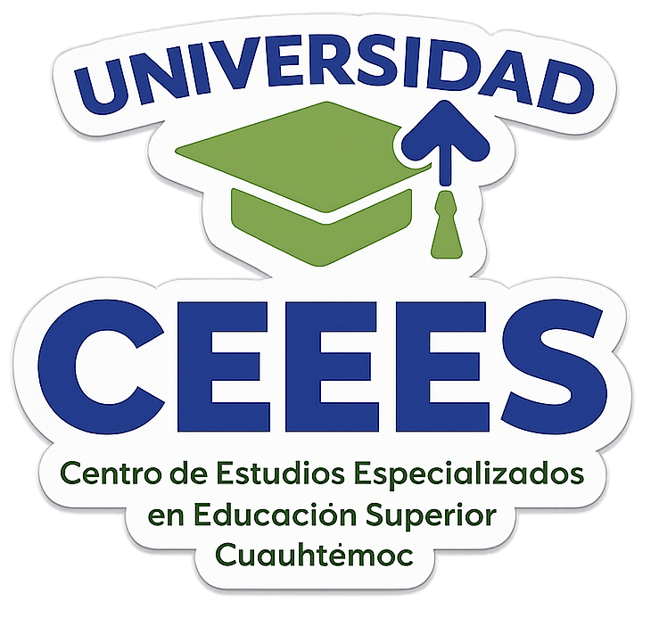
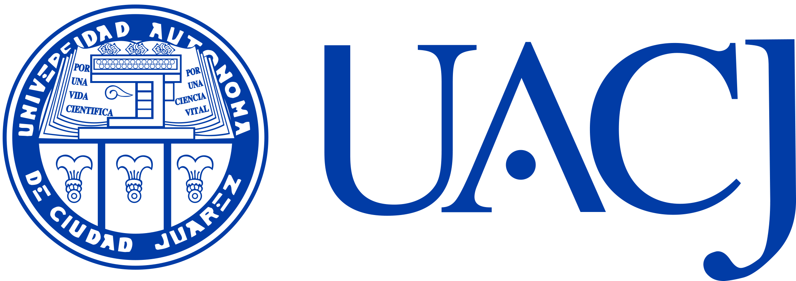
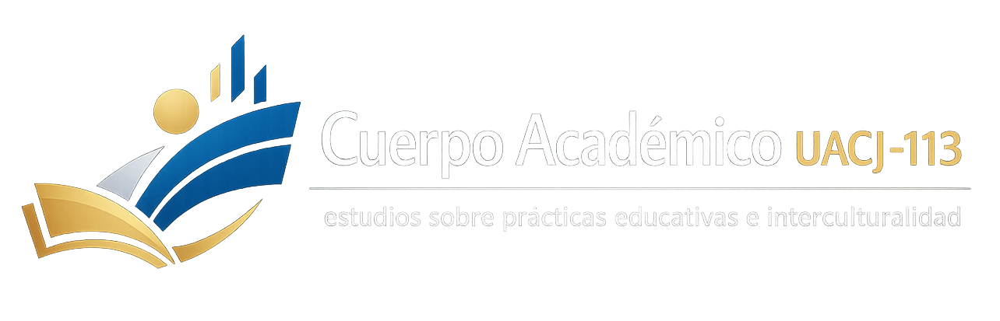

# Rarámuri Digital

[English version](README.en.md)

Infraestructura lexicográfica rarámuri–español para consulta académica, análisis lingüístico, humanidades digitales y desarrollo de aplicaciones.

🌐 **Sitio público:** [raramuri.ceees.mx](https://raramuri.ceees.mx)<br>
📦 **Datos y API:** [raramuri.ceees.mx/descargas](https://raramuri.ceees.mx/descargas)

<p align="center">
  <a href="https://ceees.mx/" title="Universidad CEEES">
    
  </a>
  &nbsp;&nbsp;&nbsp;&nbsp;
  <a href="https://www.uacj.mx/" title="Universidad Autónoma de Ciudad Juárez">
    
  </a>
  &nbsp;&nbsp;&nbsp;&nbsp;
  <a href="https://erevistas.uacj.mx/ojs/index.php/biniriame/about" title="Cuerpo Académico UACJ-113">
    
  </a>
</p>

## Responsable

**Dr. Fernando Sandoval Gutiérrez**<br>
Coordinación académica y técnica<br>
Universidad CEEES · Universidad Autónoma de Ciudad Juárez · Cuerpo Académico UACJ-113<br>
[fernando.sandoval@uacj.mx](mailto:fernando.sandoval@uacj.mx) · [ORCID 0000-0002-3168-6725](https://orcid.org/0000-0002-3168-6725)

## 🏛️ Instituciones

- [Universidad CEEES](https://ceees.mx/), Centro de Estudios Especializados en Educación Superior.
- [Universidad Autónoma de Ciudad Juárez](https://www.uacj.mx/), División Multidisciplinaria en Cuauhtémoc.
- [Cuerpo Académico UACJ-113](https://erevistas.uacj.mx/ojs/index.php/biniriame/about), Estudios sobre Prácticas Educativas e Interculturalidad.

## Cobertura

- 2,581 entradas lexicográficas con identificadores persistentes.
- Lema, forma fuente, forma normalizada y homonimia.
- Clasificación y familia gramatical.
- Traducción, acepciones, ejemplos, variantes y comentarios.
- Fuente, documento, páginas y estado de transcripción.
- 30 productos derivados: corpus, inventarios, variantes, índices, tesauro, ontología y trazabilidad.

## Formatos interoperables

| Producto | Archivo | Uso |
|---|---|---|
| XML lexicográfico | [`raramuri-lexico.xml`](public/downloads/raramuri-lexico.xml) | Humanidades digitales y transformación XML |
| JSON | [`raramuri-lexico.json`](public/downloads/raramuri-lexico.json) | Aplicaciones web y móviles |
| CSV | [`raramuri-lexico.csv`](public/downloads/raramuri-lexico.csv) | Investigación y análisis estadístico |
| SQL | [`raramuri-lexico.sql`](public/downloads/raramuri-lexico.sql) | Base normalizada para SQLite 3 |
| TEI Lex-0 | [`raramuri-lex0.xml`](public/downloads/raramuri-lex0.xml) | Diccionarios electrónicos interoperables |
| OpenAPI | [`openapi-lexico.json`](public/downloads/openapi-lexico.json) | Integración de clientes y servicios |

El [manifiesto técnico](public/downloads/manifest.json) registra tamaño, tipo de medio, cobertura y suma SHA-256 de cada exportación.

## API lexicográfica

Punto de acceso de producción:

```text
GET https://raramuri.ceees.mx/api/lexicon
```

Ejemplos:

```text
GET /api/lexicon?id=RD-000001
GET /api/lexicon?q=agua&limit=25
GET /api/lexicon?pos=Vt&page=2
GET /api/lexicon?format=csv
```

Especificación: [OpenAPI 3.1](https://raramuri.ceees.mx/api/openapi).

## Estructura del repositorio

```text
app/                 Sitio, páginas, componentes y API
data/                Bases maestras y productos derivados
db/                  Esquema relacional
drizzle/             Migración y carga de la base maestra
lib/                 Modelos de producto y derivaciones
public/downloads/    XML, JSON, CSV, SQL, TEI Lex-0 y OpenAPI
scripts/             Extracción y generación reproducible
tests/               Pruebas de cobertura e integridad
```

## Desarrollo

Requiere Node.js 22.13 o posterior.

```bash
npm install
npm run data:exports
npm test
npm run dev
```

## Estado editorial

- **Publicación:** autorizada para difusión.
- **Transcripción:** estructurada con trazabilidad por página.
- **Validación lingüística:** pendiente.

La autorización de difusión no equivale a validación lingüística. Las correcciones deben conservar el identificador de entrada y la procedencia documental.

## 🧭 Derechos lingüísticos y gobernanza

Los pueblos indígenas tienen derecho a preservar, revitalizar, utilizar, desarrollar y transmitir sus lenguas a las generaciones futuras. Este derecho está reconocido por el [artículo 13 de la Declaración de las Naciones Unidas sobre los Derechos de los Pueblos Indígenas](https://digitallibrary.un.org/record/606782?ln=es) y por la [Ley General de Derechos Lingüísticos de los Pueblos Indígenas](https://www.diputados.gob.mx/LeyesBiblio/pdf/LGDLPI.pdf) en México.

Esta infraestructura busca apoyar la documentación, consulta y enseñanza del rarámuri. No sustituye la autoridad lingüística, cultural ni política de las comunidades y personas hablantes. La reutilización de los datos debe conservar la atribución y la procedencia, evitar la apropiación y la descontextualización, respetar decisiones y restricciones comunitarias, y promover la participación efectiva de los pueblos rarámuri en la validación, corrección y gobernanza del corpus.

## Licencia

Los datos y la documentación producidos por el proyecto se distribuyen bajo [Creative Commons Atribución–NoComercial–CompartirIgual 4.0 Internacional](LICENSE.md). Los facsímiles, textos fuente, logotipos y materiales de terceros conservan sus propios derechos y no se redistribuyen mediante este repositorio.

## Cita

Consulte [`CITATION.cff`](CITATION.cff) para generar una referencia bibliográfica del proyecto.
