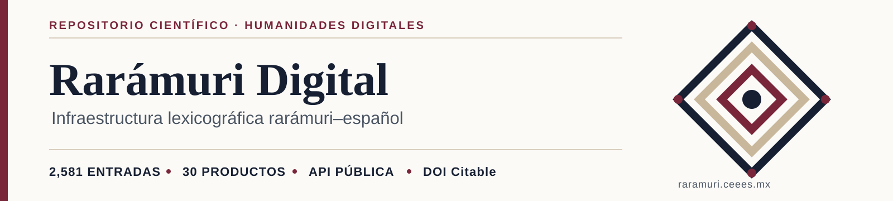
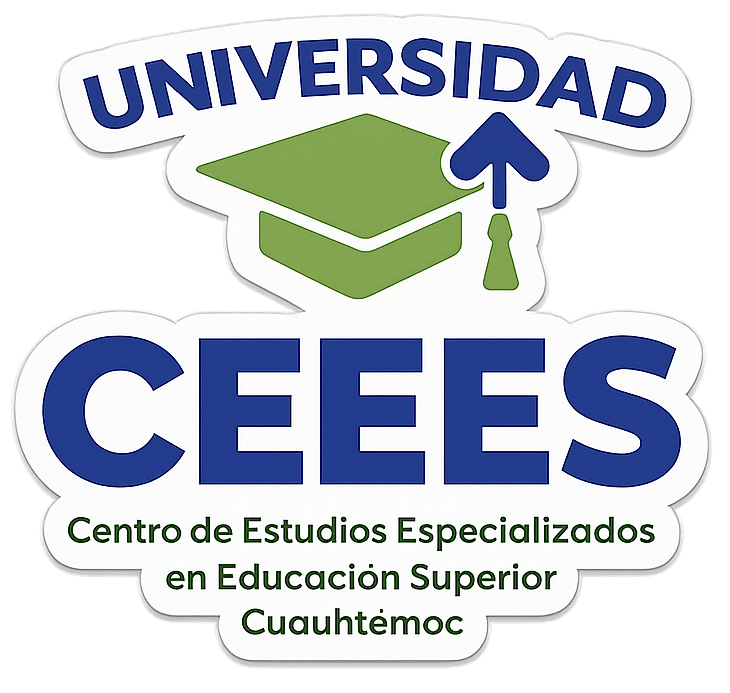
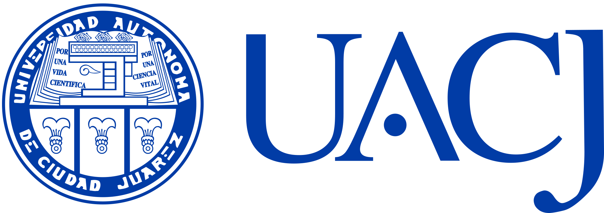
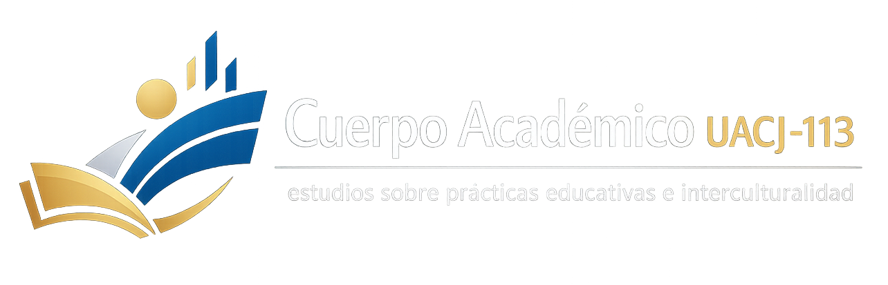

<p align="center">
  
</p>

<p align="center">
  <strong>Infraestructura lexicográfica rarámuri–español para consulta académica, análisis lingüístico, humanidades digitales y desarrollo de aplicaciones.</strong>
</p>

<p align="center">
  <a href="https://doi.org/10.5281/zenodo.21483353"></a>
  <a href="public/downloads/manifest.json"></a>
  <a href="public/downloads/manifest.json"></a>
  <a href="https://raramuri.ceees.mx/api/openapi"></a>
</p>

<p align="center">
  <a href="LICENSE.md"></a>
  <a href="DATA_LICENSE.md"></a>
  <a href="#estado-editorial"></a>
</p>

<p align="center">
  <a href="https://raramuri.ceees.mx"><strong>Sitio público</strong></a> ·
  <a href="#pru%C3%A9balo-en-30-segundos">Pruébalo</a> ·
  <a href="https://raramuri.ceees.mx/descargas">Datos y API</a> ·
  <a href="#documentaci%C3%B3n-cient%C3%ADfica">Documentación científica</a> ·
  <a href="#formatos-interoperables">Formatos</a> ·
  <a href="#api-lexicogr%C3%A1fica">API</a> ·
  <a href="#derechos-ling%C3%BC%C3%ADsticos-y-gobernanza">Gobernanza</a> ·
  <a href="#cita">Citar</a> ·
  <a href="README.en.md">English</a>
</p>

| Datos | Plataforma | Entradas | Productos | Estado lingüístico |
|---|---|---:|---:|---|
| 1.0.0 | 3.1.0 | 2,581 | 30 | Validación pendiente |

## Pruébalo en 30 segundos

Consulte cinco resultados relacionados con `agua` desde la API pública:

```bash
curl "https://raramuri.ceees.mx/api/lexicon?q=agua&limit=5"
```

Descargue directamente el conjunto de datos en el formato que necesite:

[CSV](public/downloads/raramuri-lexico.csv) ·
[JSON](public/downloads/raramuri-lexico.json) ·
[XML](public/downloads/raramuri-lexico.xml) ·
[SQL](public/downloads/raramuri-lexico.sql) ·
[TEI Lex-0](public/downloads/raramuri-lex0.xml) ·
[OpenAPI](public/downloads/openapi-lexico.json)

> [!NOTE]
> La publicación está autorizada para difusión, pero la validación lingüística permanece pendiente. Toda reutilización debe conservar atribución y procedencia y atender [`GOVERNANCE.md`](GOVERNANCE.md).

Si este recurso resulta útil para su investigación, enseñanza o desarrollo, cite el DOI y marque ⭐ el repositorio para facilitar su descubrimiento.

---

<p align="center">
  <a href="https://ceees.mx/" title="Universidad CEEES">
    
  </a>
  &nbsp;&nbsp;&nbsp;&nbsp;
  <a href="https://www.uacj.mx/" title="Universidad Autónoma de Ciudad Juárez">
    
  </a>
  &nbsp;&nbsp;&nbsp;&nbsp;
  <a href="https://erevistas.uacj.mx/ojs/index.php/biniriame/about" title="Cuerpo Académico UACJ-113">
    
  </a>
</p>

## Responsable

**Dr. Fernando Sandoval Gutiérrez**<br>
Coordinación académica y técnica<br>
Universidad CEEES · Universidad Autónoma de Ciudad Juárez · Cuerpo Académico UACJ-113<br>
[fernando.sandoval@uacj.mx](mailto:fernando.sandoval@uacj.mx) · [ORCID 0000-0002-3168-6725](https://orcid.org/0000-0002-3168-6725)

## 🏛️ Instituciones

- [Universidad CEEES](https://ceees.mx/), Centro de Estudios Especializados en Educación Superior.
- [Universidad Autónoma de Ciudad Juárez](https://www.uacj.mx/), División Multidisciplinaria en Cuauhtémoc.
- [Cuerpo Académico UACJ-113](https://erevistas.uacj.mx/ojs/index.php/biniriame/about), Estudios sobre Prácticas Educativas e Interculturalidad.

## Cobertura

- 2,581 entradas lexicográficas con identificadores persistentes.
- Lema, forma fuente, forma normalizada y homonimia.
- Clasificación y familia gramatical.
- Traducción, acepciones, ejemplos, variantes y comentarios.
- Fuente, documento, páginas y estado de transcripción.
- 30 productos derivados: corpus, inventarios, variantes, índices, tesauro, ontología y trazabilidad.

## Documentación científica

- [Ficha del conjunto de datos](DATASHEET.md) · [English](DATASHEET.en.md)
- [Esquema y diccionario de datos](SCHEMA.md)
- [Informe reproducible de calidad](QUALITY_REPORT.md) · [JSON](public/downloads/quality-report.json)
- [Gobernanza y derechos lingüísticos](GOVERNANCE.md)
- [Correcciones y contribuciones](CONTRIBUTING.md)
- [Soporte](SUPPORT.md) · [Seguridad](SECURITY.md) · [Código de conducta](CODE_OF_CONDUCT.md)
- [Autoría y funciones CRediT](CONTRIBUTORS.md)
- [Registro de cambios](CHANGELOG.md) · [Lista de publicación](RELEASE_CHECKLIST.md) · [Notas 1.0.0](RELEASE_NOTES_1.0.0.md)
- [Metadatos CodeMeta](codemeta.json) · [Cita CFF](CITATION.cff)

## Formatos interoperables

| Producto | Archivo | Uso |
|---|---|---|
| XML lexicográfico | [`raramuri-lexico.xml`](public/downloads/raramuri-lexico.xml) | Humanidades digitales y transformación XML |
| JSON | [`raramuri-lexico.json`](public/downloads/raramuri-lexico.json) | Aplicaciones web y móviles |
| CSV | [`raramuri-lexico.csv`](public/downloads/raramuri-lexico.csv) | Investigación y análisis estadístico |
| SQL | [`raramuri-lexico.sql`](public/downloads/raramuri-lexico.sql) | Base normalizada para SQLite 3 |
| TEI Lex-0 | [`raramuri-lex0.xml`](public/downloads/raramuri-lex0.xml) | Diccionarios electrónicos interoperables |
| OpenAPI | [`openapi-lexico.json`](public/downloads/openapi-lexico.json) | Integración de clientes y servicios |

El [manifiesto técnico](public/downloads/manifest.json) registra tamaño, tipo de medio, cobertura y suma SHA-256 de cada exportación.

## API lexicográfica

Punto de acceso de producción:

```text
GET https://raramuri.ceees.mx/api/lexicon
```

Ejemplos:

```text
GET /api/lexicon?id=RD-000001
GET /api/lexicon?q=agua&limit=25
GET /api/lexicon?pos=Vt&page=2
GET /api/lexicon?format=csv
```

Especificación: [OpenAPI 3.1](https://raramuri.ceees.mx/api/openapi).

## Estructura del repositorio

```text
app/                 Sitio, páginas, componentes y API
data/                Bases maestras y productos derivados
db/                  Esquema relacional
drizzle/             Migración y carga de la base maestra
lib/                 Modelos de producto y derivaciones
public/downloads/    XML, JSON, CSV, SQL, TEI Lex-0 y OpenAPI
scripts/             Extracción y generación reproducible
tests/               Pruebas de cobertura e integridad
*.md                  Ficha, esquema, calidad, gobernanza y publicación
```

## Desarrollo

Requiere Node.js 22.13 o posterior.

```bash
npm install
npm run data:exports
npm run data:quality
npm run validate
npm run dev
```

## Estado editorial

- **Publicación:** autorizada para difusión.
- **Transcripción:** estructurada con trazabilidad por página.
- **Validación lingüística:** pendiente.

La autorización de difusión no equivale a validación lingüística. Las correcciones deben conservar el identificador de entrada y la procedencia documental.

## 🧭 Derechos lingüísticos y gobernanza

Los pueblos indígenas tienen derecho a preservar, revitalizar, utilizar, desarrollar y transmitir sus lenguas a las generaciones futuras. Este derecho está reconocido por el [artículo 13 de la Declaración de las Naciones Unidas sobre los Derechos de los Pueblos Indígenas](https://digitallibrary.un.org/record/606782?ln=es) y por la [Ley General de Derechos Lingüísticos de los Pueblos Indígenas](https://www.diputados.gob.mx/LeyesBiblio/pdf/LGDLPI.pdf) en México.

Esta infraestructura busca apoyar la documentación, consulta y enseñanza del rarámuri. No sustituye la autoridad lingüística, cultural ni política de las comunidades y personas hablantes. La reutilización de los datos debe conservar la atribución y la procedencia, evitar la apropiación y la descontextualización, respetar decisiones y restricciones comunitarias, y promover la participación efectiva de los pueblos rarámuri en la validación, corrección y gobernanza del corpus.

## Licencias

Este repositorio utiliza licencias separadas según la naturaleza de cada componente:

- **Código fuente y componentes de software:** [Licencia MIT](LICENSE.md).
- **Datos, exportaciones lexicográficas, productos derivados y documentación producida por el proyecto:** [Creative Commons Atribución–NoComercial–CompartirIgual 4.0 Internacional](DATA_LICENSE.md).
- **Facsímiles, textos fuente, logotipos y materiales de terceros:** conservan sus derechos y condiciones originales; su presencia en el repositorio no los incorpora a ninguna de las licencias anteriores.

La Licencia MIT no concede permisos sobre los datos, los materiales culturales ni los contenidos de terceros. La reutilización de datos debe conservar la atribución y la procedencia, atender la gobernanza descrita en [`GOVERNANCE.md`](GOVERNANCE.md) y evitar la apropiación o descontextualización.

## Cita

Sandoval Gutiérrez, F. (2026). *Rarámuri Digital: conjunto de datos lexicográficos rarámuri–español* (versión 1.0.0) [Conjunto de datos]. Zenodo. <https://doi.org/10.5281/zenodo.21483353>

Consulte [`CITATION.cff`](CITATION.cff) para generar otros estilos bibliográficos. La versión citada de los datos es 1.0.0; la plataforma operativa es 3.1.0.
